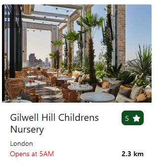
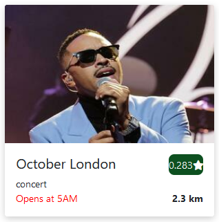

# Events Round The Corner

## Description

Someone from The US has moved to the UK and wishes to explore all the major cities in their spare time. In order to make the search a simple task for the foreigner we have devised an app that can provide events in the local area that they're in. These events and/or food places will guarantee they have a verified and vouched experience wherever they are in the UK.

## User Story

```
I moved from US to the UK.
I wish to explore all the major cities in my spare time.
I want application that can provide events in local area.
I want appication that can provide bars/restaurants in local area
I want that I can search by city/town name
```

## Usage

Application using ` SeatGeek API` and `Wyre-Data API` to pull information based on user input in searchbox.

Application will display all available restaurants (limited amount - can be changed in `script.js` file.)

Application Generates specific style restaurant/event cards with `script.js`

Application uses Latitude and Longitude to link `SeatGeek API` and `Wyre-Data API`

## Card Design Examples

### Restraurant Card



### Event Card



## Deployed Demo application

[Deployed Demo](https://andsn1.github.io/PROJECT-ONE-/)

## Resources

[Bootstrap](https://getbootstrap.com/)

[JQuery](https://jquery.com/)

[DayJs](https://day.js.org/)

## API's Used

[SeatGeek API](https://platform.seatgeek.com/)

[Wyre-Data API](http://www.wyredata.com/)

## Contributors

[Gatis Jansons](https://github.com/RexActor)

[Anderson Jesse](https://github.com/Andsn1)

[Bandoo Jermaine](https://github.com/jjbstudent)

[Hallassou Lowell](https://github.com/LoHallassou)

[Sharma Nidhi](https://github.com/ns6296666)

## License

[MIT](https://choosealicense.com/licenses/mit/)
